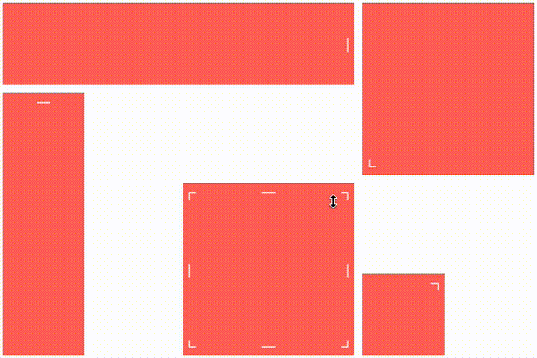

# \<the-grid\>

[](https://www.webcomponents.org/element/vpusher/the-grid)

> A digital frontier...

Grid layout custom element based on **ES2015** and **Polymer 2.0**.

Features:

* Draggable tiles
* Resizable tiles
* Overlappable tiles
* Collision detection
* Auto growing grid size
* Constraints on tile size
* Mobile support

Example:
<!---
```
<custom-element-demo>
  <template>
    <script src="../webcomponentsjs/webcomponents-lite.js"></script>
    <link rel="import" href="the-grid.html">
    <style>
        the-grid > div {
            background: #ff4d43;
            opacity: 0.9;
            color: white;
            cursor: move;
            overflow: hidden;
        }

        the-grid > div[placeholder] {
            background: #afafaf;
        }
        
        the-grid [resize] {
            position: absolute;
        }

        the-grid [resize="bottom-right"] {
            bottom: 0;
            right: 0;
            cursor: nwse-resize;
        }

        the-grid [resize="bottom-left"] {
            bottom: 0;
            left: 0;
            cursor: nesw-resize;
        }

        the-grid [resize="top-right"] {
            top: 0;
            right: 0;
            cursor: nesw-resize;
        }

        the-grid [resize="top-left"] {
            top: 0;
            left: 0;
            cursor: nwse-resize;
        }

        the-grid [resize="left"] {
            top: 50%;
            left: 0;
            cursor: ew-resize;
            margin-top: -10px;
        }

        the-grid [resize="top"] {
            top: 0%;
            width: 100%;
            text-align: center;
            cursor: ns-resize;
        }

        the-grid [resize="right"] {
            top: 50%;
            right: 0;
            cursor: ew-resize;
            margin-top: -10px;
        }

        the-grid [resize="bottom"] {
            bottom: 0;
            width: 100%;
            text-align: center;
            cursor: ns-resize;
        }
    </style>
    <next-code-block></next-code-block>
  </template>
</custom-element-demo>
```
-->
```html
<the-grid draggable resizable animated col-count="6" row-count="4" cell-margin="10">
    <div class="tile" col="0" row="0" height="1" width="4">
        <span resize="right">│</span>
    </div>
    <div class="tile" col="0" row="1" height="3" width="1">
        <span resize="top">─</span>
    </div>

    <div class="tile" col="4" row="3" height="1" width="1">
        <span resize="top-right">┐</span>
    </div>

    <div class="tile" col="4" row="0" height="2" width="2">
        <span resize="bottom-left">└</span>
    </div>
    <div class="tile" col="2" row="2" height="2" width="2">
        <span resize="left">│</span>
        <span resize="right">│</span>
        <span resize="top">─</span>
        <span resize="bottom">─</span>
        <span resize="top-right">┐</span>
        <span resize="top-left">┌</span>
        <span resize="bottom-right">┘</span>
        <span resize="bottom-left">└</span>
    </div>
    <div placeholder></div>
</the-grid>
```



## Installation

First, make sure you have [Bower](https://bower.io/) and the [Polymer CLI](https://www.npmjs.com/package/polymer-cli) installed.

Then,

```
bower install
polymer serve -o
```

## Usage

### The grid's container

Add a `<the-grid>` element to your page:

```html
<the-grid></the-grid>
```

> This will show an empty static grid with the default disposition layout with no move or resize capabilities.

You can add the `draggable` or `resizable` attribute (or both) to enable respectively tile's drag'n'drop or tile's resizing.

```html
<the-grid draggable></the-grid>
```

> This will show an empty grid with the default disposition layout and also the ability to move tiles by drag'n'drop.

Layout can be modified using the following attributes:

* **cell-height**: height of the vertical unit in pixels
* **cell-width**: width of the horizontal unit in pixels
* **cell-margin**: inner space between tiles, both horizontally and vertically.
* **col-count**: grid width as an amount of columns.
* **row-count**: grid height as an amount of columns.

> The number of columns `col-count` and number of rows `row-count` are by default fixed, and represents the grid size. Nevertheless, you can allow the grid
> to auto increase its size with respectively `col-autogrow` and `row-autogrow` boolean attributes. This behavior occurs when a tile is resized or moved
> while being on the edge of the grid.

Also, you can allow tiles to overlap each other using `overlappable` attribute:

```html
<the-grid overlappable></the-grid>
```

### The grid's children (akka tiles).

Each direct child of `<the-grid>` will be considered as a grid tile that can be moved or resized depending on the grid properties.

Grid's children can be of any types: `<div>`, `<p>`, `<span>`, `<tile>`, ... or even your own custom element: `<grid-tile>`.

```html
<the-grid>
    <div col="2" row="1" height="1" width="3" ></div>
    <paper-card col="0" row="0" height="2" width="2" ></paper-card>
</the-grid>
```

Each child needs **4 attributes** which define its position and size within the grid:

* **col**: the column index of the top-left corner of the tile (starts from 0).
* **row**: the row index of the top-left corner of the tile (starts from 0).
* **width**: the column spanning of the tile as an amount of columns  (~colspan).
* **height**: the row spanning of the tile as an amount of rows (~rowspan).

### The grid's placeholder

If you need some placeholder while dragging or resizing a tile for preview purpose,
simply add a child to `<the-grid>` with the placeholder attribute.

```html
<the-grid>
    <div placeholder style="color: grey"></div>
</the-grid>
```

> This will enable a grey placeholder in the grid only visible while dragging and resizing tiles.

### The tile's grippers (akka resizers).

If the grid has the `resizable` attribute, tiles can be resized by grabbing elements called **grippers** or **resizers**.

Those elements can be of any types, they just need to have a `resize` attribute so the grid can find them.

```html
<the-grid>
    <div col="2" row="0" height="1" width="1" >
        <span resize="right">│</span>
    </div>
</the-grid>
```

> Here, a tile is added to the grid. It has a nested **right** gripper so it can be used to resize the tile by the right edge. 

Resize grippers can take the following values:

* **top**: resize the tile by the top edge.
* **bottom**: resize the tile by the bottom edge.
* **left**: resize the tile by the left edge.
* **right**: resize the tile by the right edge.
* **top-left**: resize the tile by the top and left edges at the same time.
* **top-right**: resize the tile by the top and right edges at the same time.
* **bottom-left**: resize the tile by the bottom and left edges at the same time.
* **bottom-right**: resize the tile by the bottom and right edges at the same time.

> Several grippers can be used for the same tile. They can be nested wherever in the tile element.

## Contributing

1. Fork it!
2. Create your feature branch: `git checkout -b my-new-feature`
3. Commit your changes: `git commit -am 'Add some feature'`
4. Push to the branch: `git push origin my-new-feature`
5. Submit a pull request :D

## History

* **1.3.0:** Ability to add constraints on tile size as min/max width and height.
* **1.2.0:** Introduce autogrow feature and custom events.
* **1.1.0:** Introduce overlappable feature.
* **1.0.3:** Ability to generate grid's children with templates.
* **1.0.2:** Fixes shadow dom wrapping.
* **1.0.1:** Enhanced mobile support.
* **1.0.0:** Initial release.

## License

MIT license
